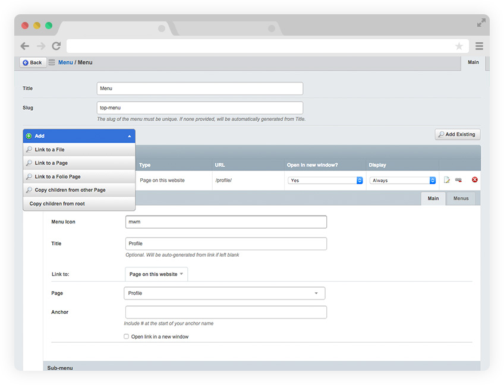

Menus for Linkable
======
This is an extension to add menu management for the Linkable module. It works in a tree view within GridField for easy visualising, and the ability to add sub-menus.



Also includes some templates so you can easily use them recursively in your own templates (or as a base to copy from so you can have your own classes). By default, the templates are compatible with Twitter Bootstrap.

## Install
Add the following to your composer.json file

```

    "require"          : {
		"milkyway-multimedia/ss-linkable-menus": "dev-master"
	}

```

### Requirements
If installing manually, the following modules are required to get this one to work properly

* [Silverstripe Linkable](https://github.com/sheadawson/silverstripe-linkable)
* [SilverStripe Grid Field Extensions Module](https://github.com/silverstripe-australia/silverstripe-gridfieldextensions)
* [GridField Utilities](https://github.com/milkyway-multimedia/ss-gridfield-utils)

### Usage in templates

```

    <% include LinkableMenu menuSlug='ENTER NAME OF SLUG HERE' %>

```

## Credits
* [Heyday Menu Manager](https://github.com/heyday/silverstripe-menumanager) - Lots of code borrowed from their module, but I wanted something that used existing modules and supported sub menus
* [Heyday Labs](https://github.com/heyday) - Author of above module
* [Font Awesome](http://fontawesome.io) - Used their bars icon for the menu icon

## License 
* MIT

## Version 
* Version 0.2 (Alpha)

## Contact
#### Milkyway Multimedia
* Homepage: http://milkywaymultimedia.com.au
* E-mail: mell@milkywaymultimedia.com.au
* Twitter: [@mwmdesign](https://twitter.com/mwmdesign "mwmdesign on twitter")